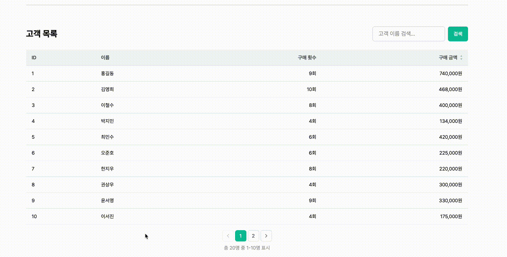
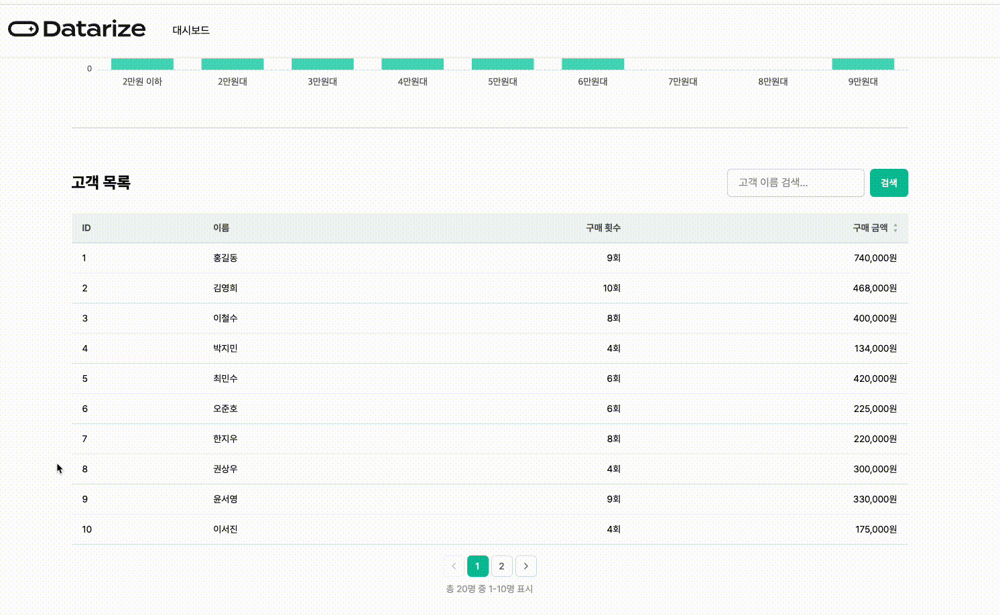

# Datarize Frontend 과제 전형

안녕하세요 프론트엔드 과제 지원자 정호진입니다. 데이터라이즈 프론트엔드 과제 제출합니다.

## 코드 실행 방법

**해당 프로젝트는 `node 20.13.1`, `yarn 1.22.22` 버전으로 세팅되었습니다**

```cmd
cd apps
yarn install
yarn start-server
yarn start-client
```

### 테스트실행 방법

```cmd
yarn client-test
```

# 구현된 페이지 및 기능

## 구매 빈도 차트 기능


- [x] 바 차트를 구현한다
- [x] 가격을 끊는 범위는 만원 단위로 구분된다
- [x] 날짜 선택을 통해 특정 기간을 조회할 수 있도록 한다
- [x] Loading, ErrorFallback 컴포넌트 구현

### 제안 사항

날짜 필터 단일 조건을 입력할 수 있도록 하면 좀 더 자연스러운 UX가 제공될 것 같습니다.

**현재 상황**

가격대별 구매 빈도 조회 시, 시작일(`from`)과 종료일(`to`)을 **모두** 입력해야만 필터링이 적용됩니다.

**제안**

시작일 또는 종료일 **하나만 설정해도** 필터링이 동작하도록 변경을 제안합니다.

- `from`만 설정 → 해당 날짜 이후의 모든 데이터 조회
- `to`만 설정 → 해당 날짜 이전의 모든 데이터 조회

**기대 효과**

- "적용" 버튼 클릭 없이 즉시 필터링이 가능해져 사용자 액션 감소
- 보다 유연한 날짜 범위 조회로 UX 개선

---

## 고객 목록 차트 기능



- [x] 가장 많이 구매한 고객을 내림차순/오름차순으로 정렬하여 보여준다
- [x] 기본 정렬은 ID로 한다
- [x] 각 고객의 ID, 이름, 구매 횟수, 구매 금액을 표시한다
- [x] 고객의 이름을 통해 검색 가능하도록 한다.
- [x] Loading, ErrorFallback 컴포넌트 구현

### 제안 사항

검색 결과가 없는 경우에 404에러를 반환하지 않고 빈 배열로 반환 하는것을 제안합니다

**현재 상황**

고객 이름 검색 시 결과가 없으면 **404 에러**를 반환합니다.

**문제점**

- 실시간 검색 시 ErrorBoundary가 즉시 트리거되어 UX 저하
- "검색 결과 없음"은 에러 상황이 아닌 **정상적인 빈 결과**
- 에러 처리 로직의 일관성 부재 (다른 목록 API는 빈 배열 반환)

**제안**

검색 결과가 없을 경우 404 에러 대신 **빈 배열(`[]`)을 반환**하도록 변경을 제안합니다.

**기대 효과**

- 프론트엔드에서 일관된 데이터 처리 가능 (`data.length === 0`으로 빈 상태 처리)
- ErrorBoundary 트리거 없이 자연스러운 "검색 결과 없음" UI 표시
- 실시간 검색 기능 구현 시 부드러운 UX 제공

## 고객 구매 상세 기능



- [x] 고객 Row 선택시 해당 고객의 상세 구매 내역을 확인할 수 있도록 한다
- [x] 검색 결과에는 고객의 구매 날짜, 구매 제품 목록, 제품가격, 제품 썸네일을 포함한다
- [x] Loading, ErrorFallback 컴포넌트 구현

## 색상

- 전반적인 색상은 데이터라이즈 홈페이지에 있는 `brandColor` 들을 사용했습니다

---

## 폴더 구조

```
src/
├── assets/              # 전역 아이콘, 이미지 등 정적 자원
├── components/          # 전역 공통 컴포넌트 (Pagination, Header 등)
├── hooks/               # 전역 커스텀 훅 (usePagination, useDebounce 등)
├── layout/              # 레이아웃 컴포넌트
├── pages/               # 라우트 단위 페이지 컴포넌트
├── test/                # 테스트 설정 파일
└── domains/             # 도메인별 기능 모듈
    ├── customer/        # 고객 관련 도메인
    │   ├── customer-list/       # 고객 목록 기능
    │   │   ├── components/      # UI 컴포넌트
    │   │   ├── hooks/           # 커스텀 훅
    │   │   ├── queries/         # React Query 훅
    │   │   ├── utils/           # 유틸리티 함수
    │   │   └── errors/          # 에러 클래스
    │   ├── customer-purchases/  # 고객 구매 내역 기능
    │   │   ├── components/
    │   │   ├── queries/
    │   │   └── errors/
    │   ├── assets/              # 도메인 전용 아이콘
    │   └── types.ts             # 도메인 타입 정의
    └── purchase-frequency/      # 구매 빈도 분석 도메인
        ├── components/
        ├── queries/
        ├── utils/
        ├── errors/
        └── __tests__/           # 도메인 단위 테스트
```

### 설계 원칙

**도메인 기반 구조 (Domain-Driven Structure)**

기능별로 관련 코드를 한 곳에 모아 **응집도를 높이고 결합도를 낮추는** 구조를 채택했습니다. 데이터라이즈에서는 어떤 폴더구조를 채택하고 있고 그 이유는 무엇인지 궁금합니다!

- **장점**: 특정 기능 수정 시 관련 파일이 한 폴더에 모여 있어 탐색이 용이
- **확장성**: 새로운 도메인 추가 시 독립적인 폴더로 분리 가능
- **명확한 경계**: 도메인 간 의존성을 최소화하여 유지보수성 향상

---

## 기술 스택 선정 이유

### TanStack React Query

- **서버 상태 관리**: 클라이언트 상태와 서버 상태를 명확하게 분리
- **자동 캐싱**: 동일한 쿼리에 대한 중복 요청 방지 및 캐시 재사용
- **Suspense 통합**: `useSuspenseQuery`로 선언적인 로딩/에러 처리
- **자동 재시도**: 네트워크 오류에 대한 자동 복구 및 백그라운드 리페칭

### Tailwind CSS v4

- **가벼운 번들 크기**: 사용한 클래스만 빌드에 포함되어 최종 CSS 용량 최소화
- **높은 커스터마이징**: CSS 변수 기반 테마 설정으로 색상, 간격, 폰트 등 손쉬운 확장
- **유틸리티 기반**: 클래스 조합으로 빠르게 UI 구성, 높은 개발 생산성
- **일관된 디자인 시스템**: spacing, colors, typography 토큰으로 UI 일관성 확보
- **CSS-first 설정**: v4의 `@theme` 디렉티브로 CSS 파일 내에서 직접 테마 정의

### ECharts + echarts-for-react

- **높은 성능**: Canvas 기반 렌더링으로 대용량 데이터도 부드럽게 처리
- **반응형 지원**: 컨테이너 크기에 맞춰 자동 리사이징
- **세밀한 커스터마이징**: 툴팁, 축, 색상 등 다양한 스타일 옵션 제공

### react-error-boundary

- **선언적 에러 처리**: try-catch 없이 컴포넌트 트리에서 에러를 선언적으로 처리
- **Fallback UI**: 에러 발생 시 사용자 친화적인 대체 UI 표시
- **에러 복구**: `resetErrorBoundary`로 에러 상태 초기화 및 재시도 지원
- **React Query 통합**: `QueryErrorResetBoundary`와 조합하여 쿼리 에러 복구

### Vitest + Testing Library

- **Vite 네이티브**: Vite와 동일한 설정 공유로 빠른 테스트 실행
- **Jest 호환 API**: 기존 Jest 문법 그대로 사용 가능, 낮은 학습 비용
- **사용자 관점 테스트**: 구현 세부사항이 아닌 사용자 동작 기반 테스트 작성
